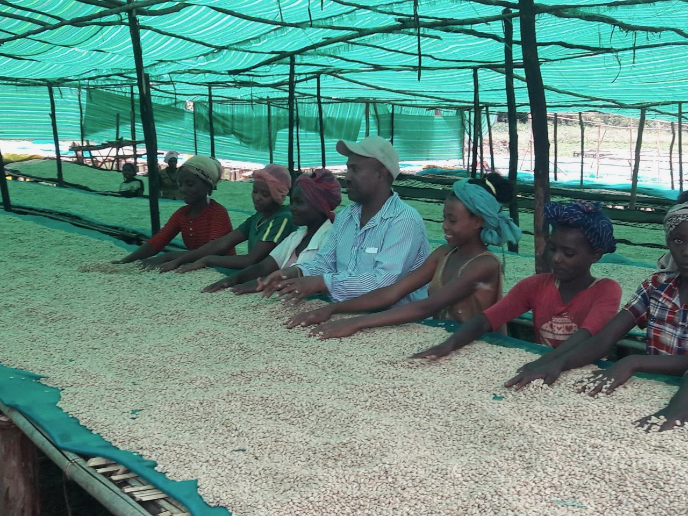
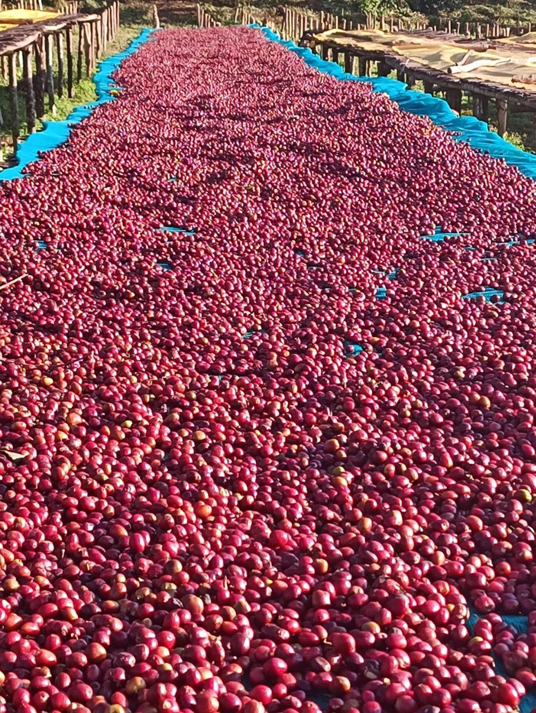
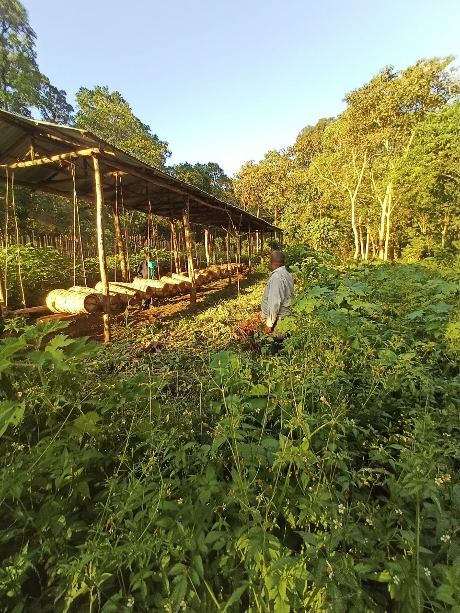
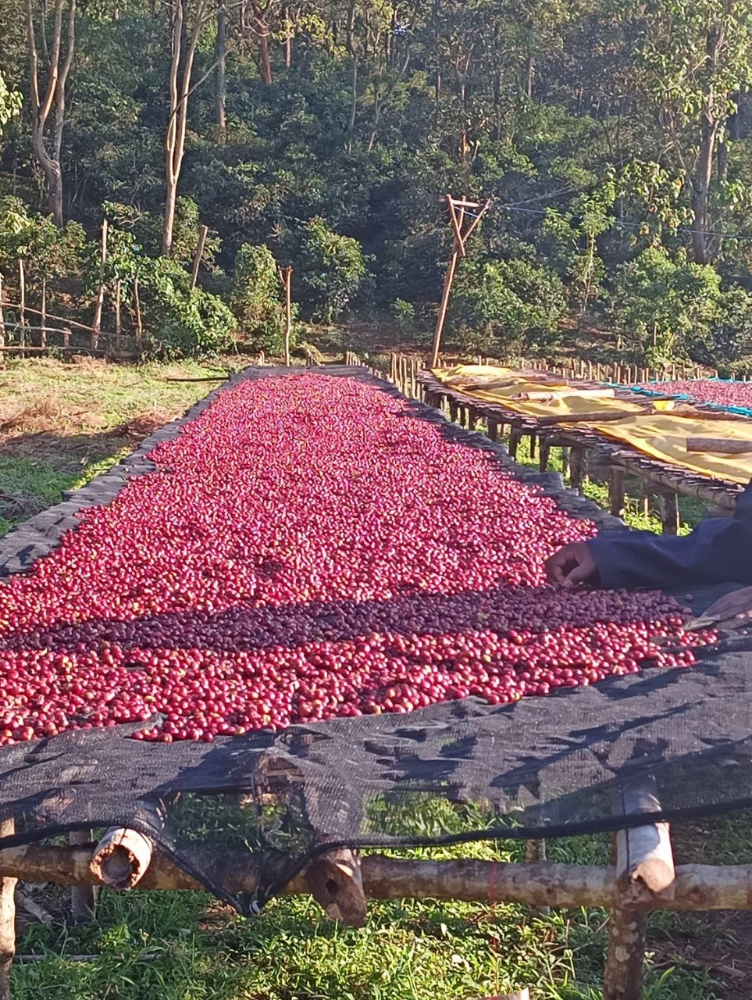
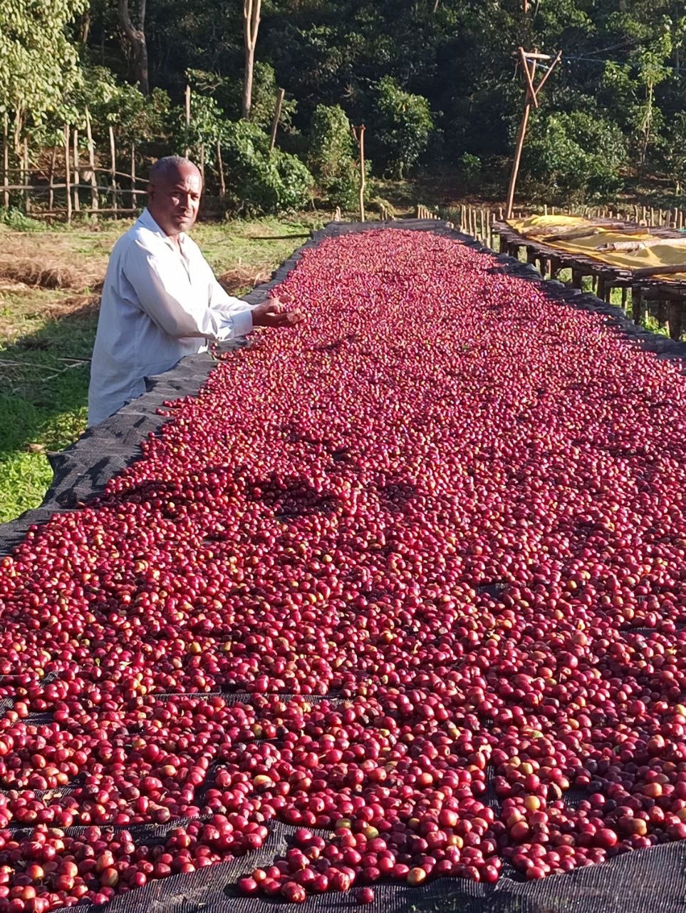
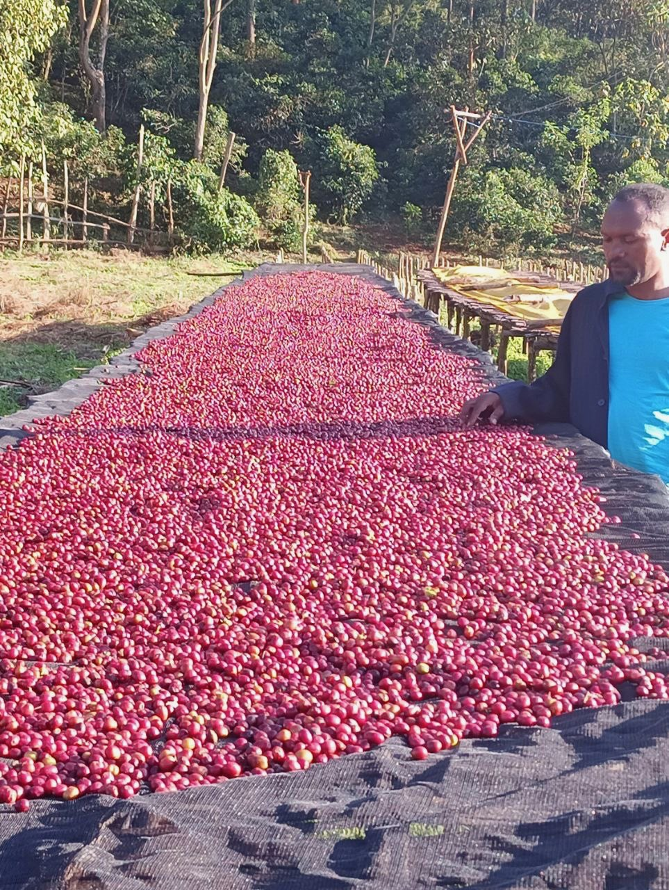
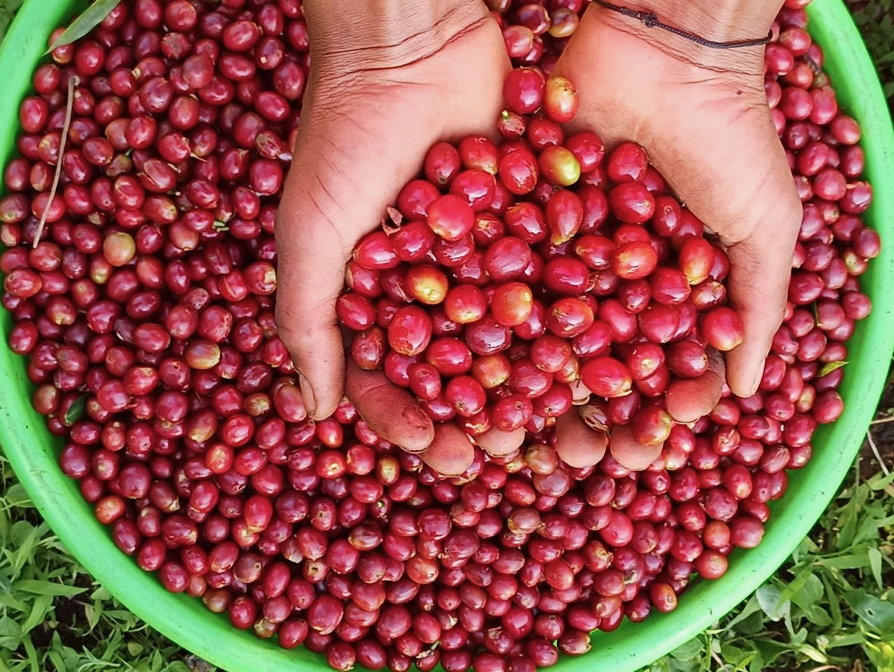
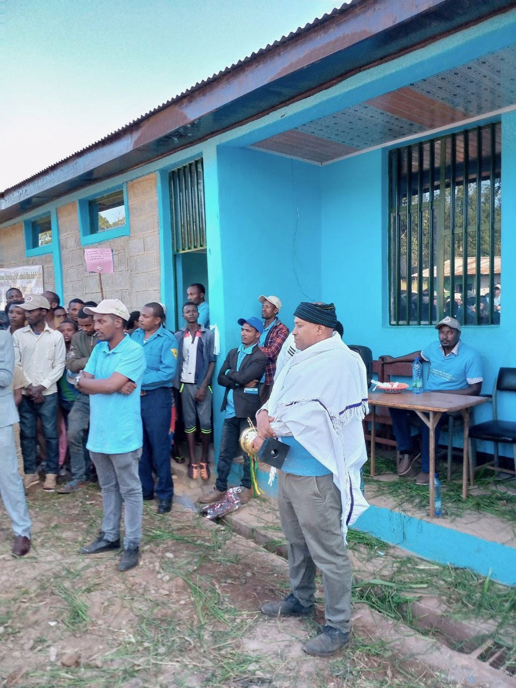

### A Visual Look at Life on the Farm

Take a tour of MB Coffee's home in **Guji, Ethiopia** — from hand-picking ripe cherries to sun-drying and community-powered processing.

Our farm is more than a place — it's a story of heritage, care, and quality in every bean.

---

  

    
    
Hand-sorting green coffee under shade for quality control

  

  

    
    
Sun-drying cherries for flavor clarity and consistency

  

  

    
    
Guji’s fertile land — where it all begins

  

  

    
    
Raised beds enhance air flow for even drying

  

  

    
    
Daily inspections during drying for optimal results

  

  

    
    
Careful drying ensures even moisture and quality

  

  

    
    
Ripe cherries, hand-picked at peak ripeness

  

  

    
    
Our team and community gathered at the farm's hub

  

